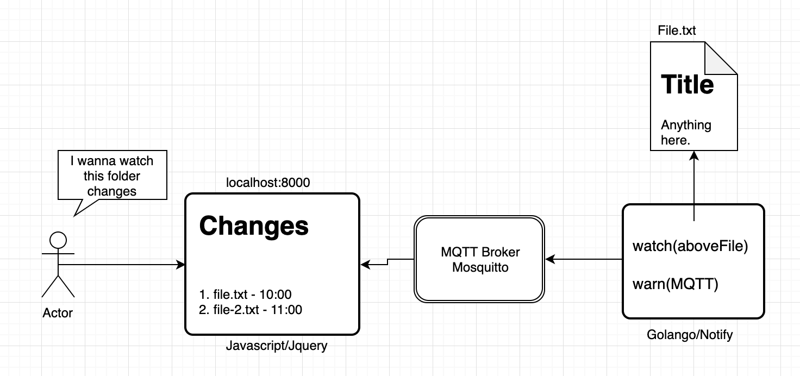
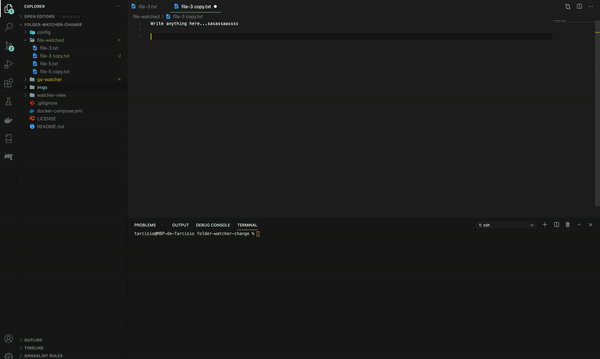

# folder-watcher-change

Project to test a simple, but efficient broadcaster architeture. On this project, there's 4 actors. A folder wich contains some text files, a golang watching any change in this folder, a MQTT broker warned by the golango app. And at last, a embedded Javascript in HTML, wich stay connected on MQTT broker, and show any changes on screen using Jquery magic.

### Architeture

### Bring it up

As simple as it can, just do on console:

    docker-compose up

So, 3 docker images will be received. When it's done, a ngnix will be exposing by port 80. Docker will make a fast forward from port 8000 to 80. Thus, open your browser on address `localhost:8000`, as shown below:

### Disclaimer

The main goal of the project is to test the architeture. So, optimize the build images was **not** a concern in here. We could make a better _Dockerfile_, using a image to build and a lightweight to run the binary. Same thing for the frontend structure, which is pure HTML injecting a javascript file(MQTT lib and JQuery Lib).
